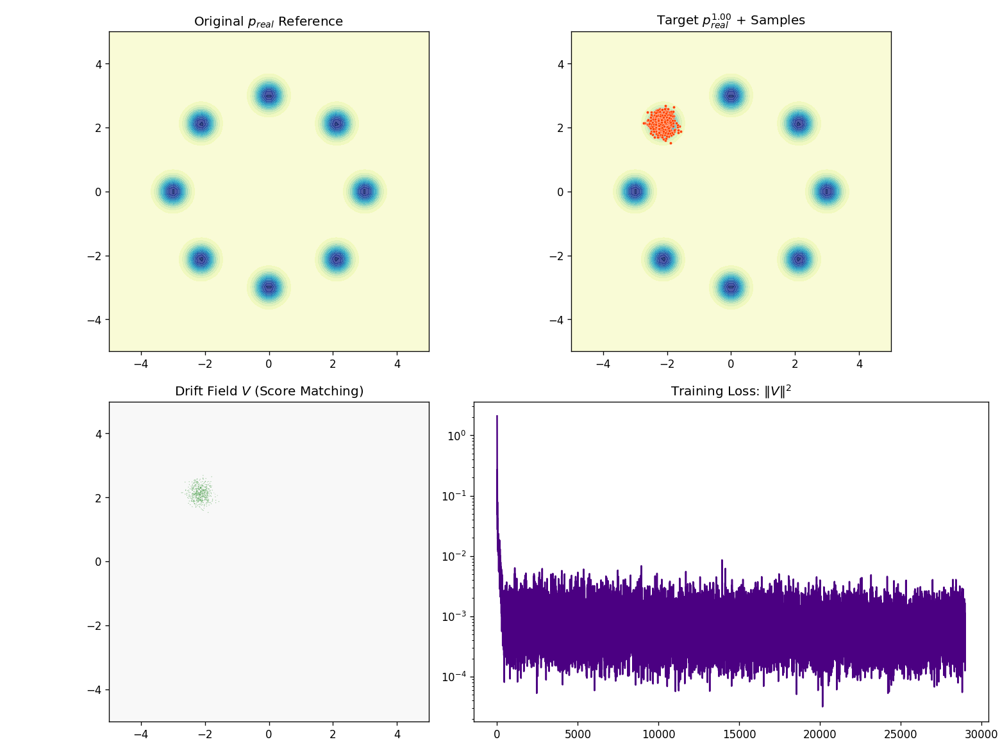
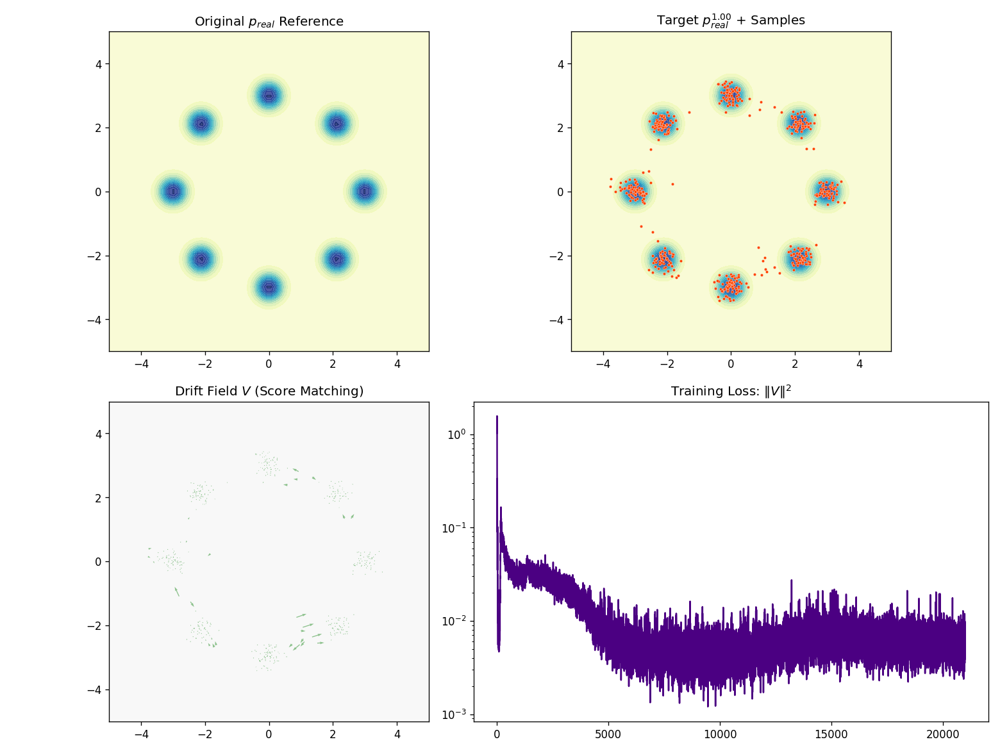
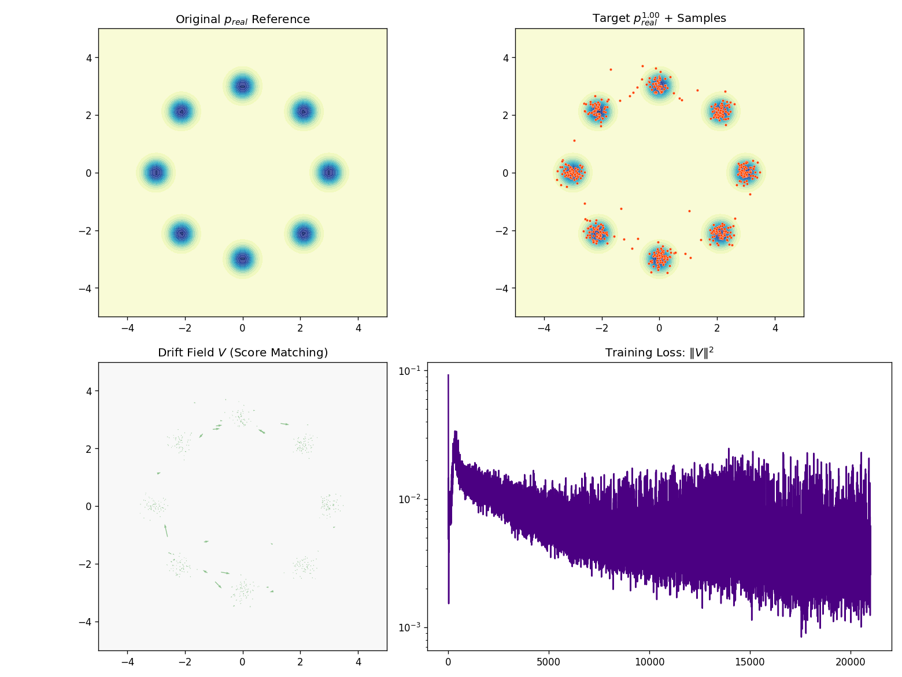
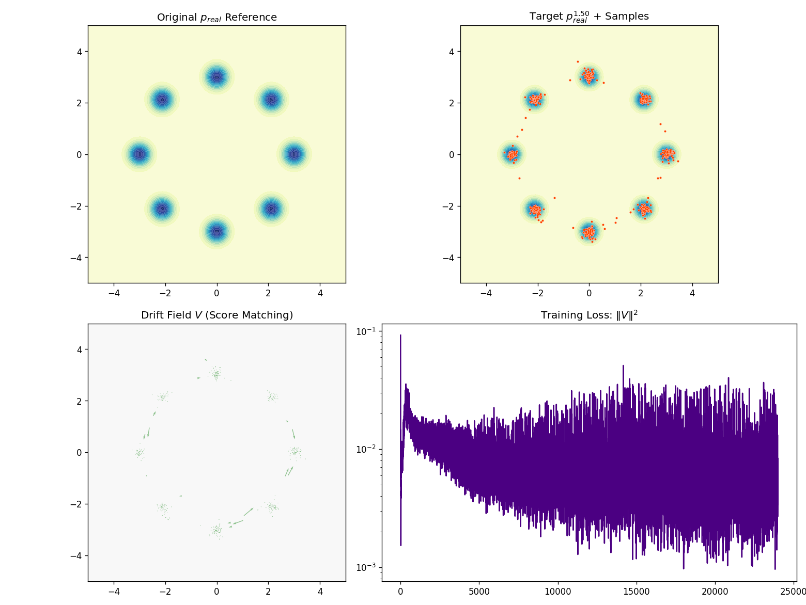

# Score-Based Distribution Matching Distillation (DMD)

This repository implements a generative modeling framework that distills a target distribution $p_{\text{real}}(x)^\gamma$ into a single-step feed-forward neural network. It utilizes **Score-Based Drift Fields** approximated via **Mean-Shift** to guide particles toward a manifold defined by power-scaled real-world data.

## Theoretical Overview

The generator $f_\theta(e)$ is trained by minimizing the Mean Squared Error (MSE) between the current sample $x$ and a target position $x + V$, where $V$ is a drift field derived from the balance of scores:

$$V(x) = \gamma \nabla_x \log p_{\text{real}}(x) - \nabla_x \log p_{\text{fake}}(x)$$

Using the **Mean-Shift approximation**, we represent the score as the vector pointing from the current sample to the weighted local barycenter. This implementation ensures that the model does not "collapse" to the origin by strictly computing relative scores:

$$V = \gamma \underbrace{\left( \frac{\sum w_{i} y_{i}}{\sum w_{i}} - x \right)}_{\text{Real Score}} - \underbrace{\left( \frac{\sum w_{j} x_{j}}{\sum w_{j}} - x \right)}_{\text{Fake Score}}$$

* **$\gamma = 1$**: This is the same as DMD loss (**Original distribution**)
* **$\gamma > 1$**: Sharpens the distribution (**Mode-Seeking/Denoising**).
* **$\gamma < 1$**: Flattens the distribution (**Exploration/Entropy increase**).

## Modular Architecture

The project is organized into distinct functional blocks to ensure maintainability:

* **`Config`**: A `dataclass` that handles hyperparameters, hardware settings, and YAML I/O.
* **`Generator`**: A Multi-Layer Perceptron (MLP) mapping latent noise to the data manifold.
* **`compute_V_DMD_Strict`**: The core "physics" engine that calculates the score-matching velocity field.
* **`update_plots`**: An isolated visualization module that generates high-contrast dashboards and exports frames.


## Configuration & Usage

### 1. Requirements
```bash
pip install torch matplotlib numpy pyyaml
```

### 2. YAML Configuration

We provide three pre-builtin yaml configuration files:
1. `config/vanilla.yaml`: This mimics the hyper-parameters used in the original paper. It sets $\gamma=1$ throughout training, which directly learns the original distribution without any mode-seeking or exploration bias. However, the temperature is a constant 0.1 so the model stucks in one mode and fails to capture the full distribution.
    
2. `config/vanilla_temperature.yaml`: This config is similar to the vanilla setup but incorporates a linear decay of the kernel temperature from 1.0 to 0.1 over 15,000 epochs. This allows the model to start with a smoother density estimate, which can help capture the overall structure of the distribution early on, and then gradually focus on finer details as training progresses. 
    
3. `config/stable_gamma.yaml`: This config implements a stable gamma warmup strategy, starting from a low value and gradually increasing to 1.0 over 15,000 epochs. This eventually learns the original distribution but with a more stable training trajectory. When gamma is small, the model focuses on capturing the overall structure of the distribution, which can lead to more stable gradients and a smoother convergence path.
    
4. `config/large_gamma.yaml`: This config explores a more aggressive mode-seeking strategy, starting from 0.2 and increasing to 1.5 over 15,000 epochs. This encourages the model to focus more on high-density regions, which can lead to sharper samples but may also introduce instability if not carefully managed.
    

### 3. Execution

The script supports loading configurations directly from the command line:

```bash
# Using a specific config file
python train.py my_config.yaml

# Using default settings
python train.py

```

## Monitoring the Dashboard

During training, a 4-panel interactive window provides real-time feedback:

1. **Original  Reference**: A static view of the ground-truth 8-mode Gaussian mixture.
2. **Target  Samples**: The power-scaled density (shaded) overlaid with generated samples (red dots).
3. **Drift Field **: A quiver plot visualizing the score-matching forces (green arrows) acting on the generator output.
4. **Training Loss**: The MSE  trajectory, indicating how well the generator matches the target score equilibrium.
